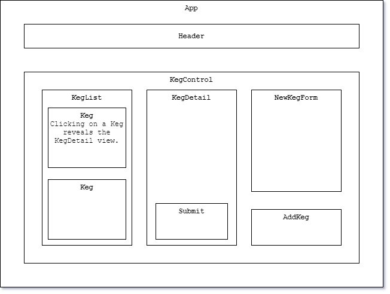

# Tap Room

  ### By [Taylor Somers](https://github.com/taylorsomers/)


<p align="center">
  <a href="#description">Description</a> •
  <a href="#requirements">Requirements</a> •
  <a href="#installation">Installation</a> •
  <a href="#contributors">Contributors</a> •
  <a href="#license">License</a>
</p>


## Description

  This application is a simulation tap-room management system that allows a user to add kegs of specified beer to the tap-room, designate the beer's name, brewery, alcohol content, and number of pints in the keg, and click a button to indicate when a pint has been sold, decrementing the number of pints in the keg. The user may also edit any of the keg details at will. All kegs are displayed in a keg list, and any kegs in the list may be clicked to display details and allow the user to edit, sell a pint, or delete the selected keg. This program was built using the React JavaScript library in Visual Studio Code.


## Languages & Technologies Used:

  ### Programming Languages, Libraries, & Frameworks
  * [JavaScript](https://developer.mozilla.org/en-US/docs/Web/JavaScript)
  * [React](https://reactjs.org/)

  ### Operating Systems & Programs
  * [Brave](https://brave.com/)
  * [Draw.io](https://app.diagrams.net/)
  * [Microsoft PowerShell](https://docs.microsoft.com/en-us/powershell/)
  * [Microsoft Windows 10](https://www.microsoft.com/en-us/windows/get-windows-10)
  * [Visual Studio Code](https://code.visualstudio.com/)


## Requirements
  * [Git v2.62.2 or Later](https://git-scm.com/downloads/)
  * [MySql Workbench](https://www.mysql.com/products/workbench/)
  * [Postman v7.30.1 or Later](https://www.postman.com/downloads/)
  * [Visual Studio Code](https://code.visualstudio.com/)
  * [.NET Core v2.2 or Later](https://dotnet.microsoft.com/download/dotnet-core/2.2)


## Installation

  1.  Make sure you have installed all <a href="#requirements">required software</a>.
  2.  Open your computer's terminal and navigate to the directory in which you would like the program to be stored.
  3.  Enter the command ```git clone https://github.com/taylorsomers/React.tap-room``` in the terminal.
  4.  Navigate to the ```React.tap-room``` directory in the terminal and enter the command ```$ npm run start```.
  5.  The program should open in a new tab in your default web browser.


## App Component Diagram




## Known Bugs

  None at this time.


## Support & Contact Details

  * You are welcome to contact the [author](https://github.com/taylorsomers/) via GitHub with any concerns, feedback, possible contributions, questions, or suggestions.


### Contributors

  * [Taylor Somers](https://github.com/taylorsomers/)
  * README Photo Credit: [Christin Hume](https://unsplash.com/@christinhumephoto?utm_source=unsplash&utm_medium=referral&utm_content=creditCopyText)


### License

  * This program is free to use under the [GNU Affero General Public License AGPLv3.0](https://www.gnu.org/licenses/agpl-3.0.html). <span></span> © 2020 Taylor Somers. All rights reserved.